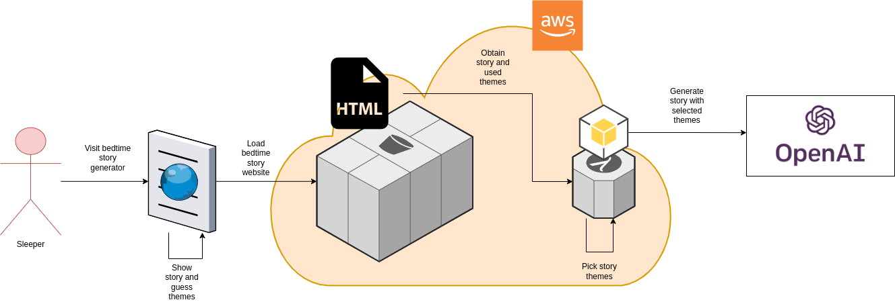

# Bedtime Story Questionnaire

## Architecture

## Technology

Svelte-kit is used to build a frontend artifact that is zipped and uploaded to an AWS S3 bucket.
This frontend artifact is an HTML website that can be used to show a bedtime story and quiz the visitor which themes were used in the story.

Python is used to build an application, uploaded to AWS Lambda, that can randomly pick several themes from a hardcoded list and connect to OpenAI and instruct it to generate a bedtime story.
The integration of AWS Lambda, Python and OpenAI is based on a proof of concept described [here](https://thedeveloperspace.com/how-to-invoke-openai-apis-from-aws-lambda-functions/).

There is no infrastructure as code; the AWS environment is set up by hand.
